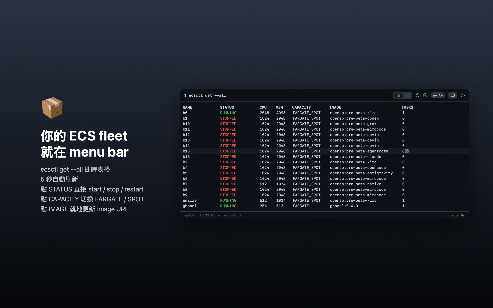
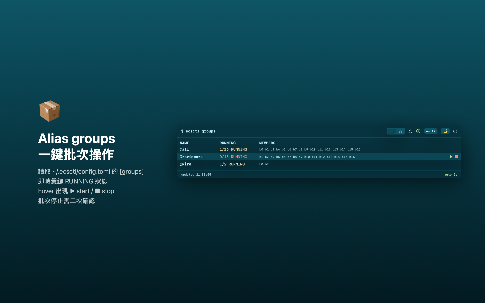

# ecsctl Bar

macOS menu bar app for [ecsctl](https://github.com/oablab/ecsctl) — live `ecsctl get --all` in your menu bar, with click-to-operate controls for the ECS Fargate fleet.





## Features

### Services view (`$ ecsctl get --all`)

- **Live table** — terminal look with ANSI-faithful status colors (green RUNNING / red STOPPED / yellow transitional), auto-refresh every 5 s (pausable)
- **Click STATUS** — start / stop / restart menu; current state is greyed out
  - start → `ecsctl scale <name> 1`, stop → `ecsctl scale <name> 0`, restart → `ecsctl restart <name>`
- **Click CAPACITY** — switch FARGATE / FARGATE_SPOT via `ecsctl update --set spec.capacity=…`
- **Click IMAGE** — popover pre-filled with the full image URI (fetched via `ecsctl export`), edit and apply via `ecsctl update --set spec.image=…`
- **Click any other cell** — copy the row
- Window width auto-fits the widest row — no horizontal scrolling

### Groups view

- Reads `[groups]` from `~/.ecsctl/config.toml`
- `NAME / RUNNING / MEMBERS` table with live aggregate status (`16/16 RUNNING`)
- Hover a group → ▶ start / ■ stop all members (`ecsctl scale @group 1|0`)
- Stop requires inline two-step confirmation (`stop 16?`) — no modal, the menu bar window stays open

### Shared

- 8 color themes (same palette as DeepSRT X Bar): GitHub Light/Dark, Solarized Light/Dark, Dracula, Nord, Monokai, Blue Dolphin
- A−/A+ font size (9–16 pt), preferences persist
- Busy spinner per row, action progress/result in the footer, auto refresh after every mutation

## Requirements

- macOS 13+, Apple Silicon
- `ecsctl` in `~/.local/bin` (also probes `/usr/local/bin`, `/opt/homebrew/bin`)
- AWS credentials in `~/.aws` (default profile)

## Build & Install

```bash
./build.sh
cp -R "ecsctl Bar.app" /Applications/
open "/Applications/ecsctl Bar.app"
```

The app is ad-hoc signed — fine for personal use, needs Developer ID + notarization for distribution.

## License

MIT
